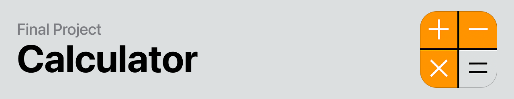
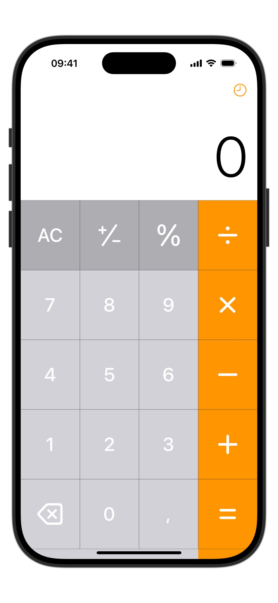
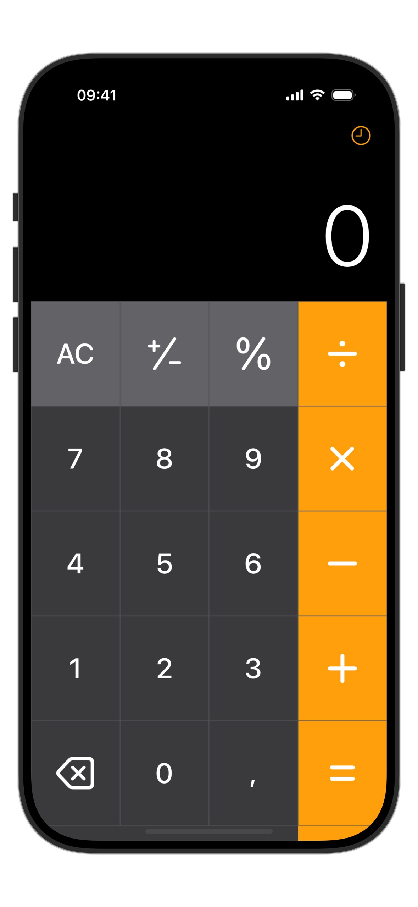

# Calculator Project

This project is a simple calculator application developed for the **Introduction to Mobile Systems L1 [W.SIE.IN.6023]** class, under the supervision of Professor **Marcin Kacprowicz AEH**.

**Student:** Ataberk Turan

This project was specifically built as a final project for this course.

## Project Description

This iOS Calculator App is a clean, user-friendly calculator developed using SwiftUI, Swift 6, and iOS 17. It captures the nostalgic feel of Apple's classic iOS 7 calculator, providing users with an intuitive layout that's easy on the eyes and simple to navigate. With vibrant orange operator buttons contrasted against subtle gray numeric and utility keys, the app delivers a clear visual hierarchy.

Behind its minimalistic design, the app handles basic arithmetic smoothly, including addition, subtraction, multiplication, division, and power operations. It evaluates operations in the exact order entered, ensuring a straightforward user experience. Additionally, it uses SwiftData to save and manage calculation histories, allowing users to revisit their past calculations conveniently.

## Building and Running the App with Xcode

To build and run this application on your Mac using Xcode, please follow these steps:

1.  **Prerequisites:**
    *   Ensure you have the latest version of Xcode installed. You can download it from the Mac App Store.
    *   This project is written in Swift and uses SwiftUI.

2.  **Clone or Download the Project:**
    *   If the project is on a version control system like Git, clone the repository to your local machine.
    *   Otherwise, download the project files and unzip them.

3.  **Open the Project in Xcode:**
    *   Navigate to the project directory where you cloned or unzipped the files.
    *   Locate the `.xcodeproj` or `.xcworkspace` file (usually, it's the one with the blue Xcode icon).
    *   Double-click this file to open the project in Xcode.

4.  **Select a Simulator or Device:**
    *   At the top of the Xcode window, next to the "Play" (Run) and "Stop" buttons, you'll see a scheme/target selector. It will likely show something like "YourProjectName > iPhone SE (3rd generation)" or a similar device.
    *   Click on this selector to open a dropdown menu.
    *   **To select a simulator:**
        *   Under the "iOS Simulators" section, you will see a list of available iPhone and iPad simulators (e.g., iPhone 15 Pro, iPad Air (5th generation), etc.).
        *   Choose the simulator you want to run the app on. If you don't see a specific simulator, you might need to download it via Xcode (Xcode > Settings > Platforms).
    *   **To select a physical device (iPhone/iPad):**
        *   Connect your physical iOS device to your Mac using a USB cable.
        *   You might need to "Trust" the computer on your device and enter your device passcode.
        *   The connected device should appear at the top of the list in the scheme/target selector. Select it. You might need to register the device with your Apple Developer account in Xcode.

5.  **Build and Run:**
    *   Once you've selected your target simulator or device, click the "Play" button (a triangle icon) in the Xcode toolbar, or press `Command + R` (`⌘R`).
    *   Xcode will compile the project and install the app on the selected simulator or device.
    *   The app should launch automatically.

## App Usage Tutorials (GIFs)

Below are some GIFs demonstrating the app's functionality:

### Percentage Operation

### Addition Operation

### Number Deletion (Clear)

### History View Tutorial

### Subtraction Operation

### Multiplication Operation

### Plus/Minus Toggle

## App Appearance (Light/Dark Mode)

<table>
  <tr>
    <td align="center">
      <strong>Light Mode</strong> 
      
    </td>
    <td align="center">
      <strong>Dark Mode</strong> 
      
    </td>
  </tr>
</table>